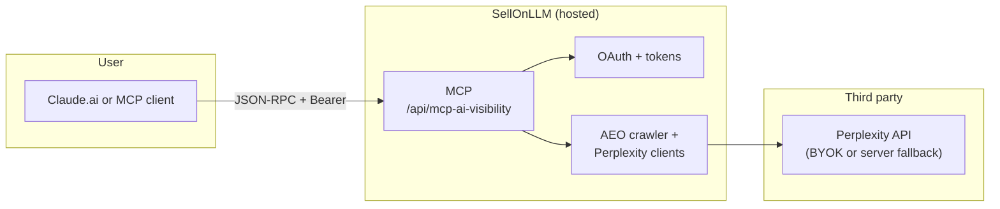

# SellOnLLM AI Visibility MCP for Claude

**Hosted [Model Context Protocol](https://modelcontextprotocol.io) (MCP) server** — connect **AEO site crawls** and **optional Perplexity Sonar citation checks** to [Claude](https://claude.ai) without self-hosting. The service runs on **[SellOnLLM](https://www.sellonllm.com)**; you add one custom connector URL and sign in with Google.

| What you paste in Claude | `https://www.sellonllm.com/api/mcp-ai-visibility` |
|--------------------------|--------------------------------------------------|
| Setup, Perplexity BYOK   | [AI Visibility MCP for Claude](https://www.sellonllm.com/ai-visibility-mcp-claude.html) |
| GA4 + Search Console MCP (separate product) | [mcp-ga-gsc-seo](https://github.com/vipul510-web/mcp-ga-gsc-seo) · [GA + GSC MCP page](https://www.sellonllm.com/google-analytics-mcp-claude.html) |

This repository is the **public documentation and community surface** for the **hosted** AI visibility MCP. Source code for SellOnLLM's backend is not required to use the connector.

**GitHub:** [github.com/vipul510-web/mcp-ai-visibility](https://github.com/vipul510-web/mcp-ai-visibility) (this repo) — issues, stars, and discoverability.

> **Skill included** — [`SKILL.md`](SKILL.md) teaches Claude to research the business first (browse or AEO crawl), build realistic buyer-intent prompts, then run MCP tools with proper context. Paste it into a **Claude Project** as a custom instruction for best results. See [Using the Skill](#using-the-skill-for-best-results) below.

---

## Table of contents

1. [Why this exists](#why-this-exists)
2. [Who it helps](#who-it-helps)
3. [Using the skill (for best results)](#using-the-skill-for-best-results)
4. [What you get in practice](#what-you-get-in-practice)
5. [Quick start (Claude.ai)](#quick-start-claudeai)
6. [Perplexity API key (BYOK)](#perplexity-api-key-byok)
7. [Built-in prompts (`/` menu)](#built-in-prompts--menu)
8. [Tools reference](#tools-reference)
9. [Example workflows](#example-workflows)
10. [How this differs from the Analytics MCP](#how-this-differs-from-the-analytics-mcp)
11. [Security & privacy (summary)](#security--privacy-summary)
12. [What you do *not* need to run](#what-you-do-not-need-to-run)
13. [Troubleshooting & FAQ](#troubleshooting--faq)
14. [For agencies and teams](#for-agencies-and-teams)
15. [Architecture (high level)](#architecture-high-level)
16. [Repository layout](#repository-layout)
17. [Support & contributing](#support--contributing)
18. [License](#license)

**Deep dives:** [`SKILL.md`](SKILL.md) · [`docs/USE_CASES.md`](docs/USE_CASES.md) · [`docs/TOOLS.md`](docs/TOOLS.md) · [`docs/PROMPTS.md`](docs/PROMPTS.md) · [`docs/ADVANCED.md`](docs/ADVANCED.md)

---

## Why this exists

Answer engines and AI-assisted search reward pages that are **clear, trustworthy, structured, and easy to cite**. The hard part is turning that into **repeatable checks**: crawl signals (schema, FAQ, depth), then **whether your domain actually appears** in model-powered citation flows for the prompts your buyers use.

This MCP exposes **tools** so Claude can call SellOnLLM's hosted crawler and (when you add a key) **Perplexity** — so recommendations cite **tool output**, not generic SEO blog advice.

---

## Who it helps

| Role | How it helps |
|------|----------------|
| **SEO / growth** | Prioritize AEO fixes (schema, FAQ, depth) with a scorecard tied to your live site. |
| **Content & comms** | Test 2–20 "money prompts" for citation visibility; brief writers on gaps. |
| **Founders & PMs** | Short, evidence-backed readouts for "are we visible in AI search for X?" |
| **Agencies** | Repeatable playbooks per client domain (each user connects their own Google account for OAuth identity). |

---

## Using the skill (for best results)

The MCP alone generates **generic prompts** if Claude has no context about your business. The **[`SKILL.md`](SKILL.md)** fixes this by instructing Claude to:

1. **Research the business first** — browse the URL or run `analyze_website_aeo` to infer offerings, audience, geo, and competitors.
2. **Build buyer-intent prompts** — not "what should I know about X?" but "best X for Y 2026", "X vs competitor", "X pricing", "X reviews".
3. **Call MCP tools with context** — pass those prompts as `seed_prompts` to `discover_ranking_prompts` for relevant, realistic results.

### How to activate the skill

**Option A — Claude Project (recommended):**
1. Create a new Claude Project → **Instructions** (or "Custom instructions").
2. Paste the full contents of [`SKILL.md`](SKILL.md) into the instructions box.
3. Add the MCP connector URL in the project's connector settings.
4. Every chat in that project automatically uses the research-first workflow.

**Option B — One-shot prompt (no Project needed):**

Paste this at the start of any conversation:

```
I want to check AI visibility for [WEBSITE URL].

Do this:
1. Research the site (browse if you can, or use analyze_website_aeo with max_pages 5).
2. Write a brief: offering, audience, geo, competitors.
3. Generate 8 buyer-intent prompts (pricing, alternatives, reviews, vs competitor, best-for-persona).
4. Run discover_ranking_prompts with those as seed_prompts.
5. Run check_ai_visibility on the top 3 most important prompts.
6. Output: business brief + table (prompt | visible | who is cited) + 14-day action plan.
```

**Option C — Cursor / local agent:**

Drop `SKILL.md` in your project's `.cursor/skills/ai-visibility-mcp/` folder and Cursor will apply it automatically when AI visibility tasks come up.

---

## What you get in practice

After you [connect the MCP](#quick-start-claudeai), you can ask Claude to:

- **Crawl and score** a public site for AEO readiness (`analyze_website_aeo`).
- **Check citations** for a specific natural-language query vs your URL (`check_ai_visibility` — needs Perplexity key).
- **Generate prompts from your site** and test visibility in batch (`discover_ranking_prompts`).
- **Run a visibility report** mixing your questions and auto-generated prompts (`get_visibility_report`).
- **Compare** your site vs competitors on the same small set of prompts (`compare_competitor_visibility`).

---

## Quick start (Claude.ai)

1. Open [claude.ai](https://claude.ai) → **Settings** → **Connectors** (Team/Enterprise: **Organization settings → Connectors**).
2. **Add custom connector** → **Server URL:** `https://www.sellonllm.com/api/mcp-ai-visibility`
3. **Connect** → complete **Google** sign-in → **Allow** on the SellOnLLM consent screen.
4. In chat: *"Run `analyze_website_aeo` on https://example.com and give me the top 5 fixes."* (No Perplexity key required for this tool.)

**Optional:** Save a **Perplexity API key** on the [setup page](https://www.sellonllm.com/ai-visibility-mcp-claude.html) (same Google session) before using citation tools.

**Claude Desktop** — see [`docs/ADVANCED.md`](docs/ADVANCED.md) for `mcp-remote` JSON.

---

## Perplexity API key (BYOK)

Required for: `check_ai_visibility`, `discover_ranking_prompts`, `get_visibility_report`, `compare_competitor_visibility`.

1. Sign in on SellOnLLM with the **same Google account** you used for the MCP connector.
2. Open **[AI Visibility MCP for Claude](https://www.sellonllm.com/ai-visibility-mcp-claude.html)** → paste key from [Perplexity API settings](https://www.perplexity.ai/settings/api) (`pplx-…`) → **Save**.

Not required for **`analyze_website_aeo`** (HTML crawl only).

---

## Built-in prompts (`/` menu)

| Prompt | What it's for |
|--------|----------------|
| **aeo_site_audit** | Crawl + AEO scorecard for a URL you provide next |
| **ai_visibility_pulse** | Quick Perplexity checks for a few prompts you care about |

More copy/paste blocks: [`docs/PROMPTS.md`](docs/PROMPTS.md).

---

## Tools reference

| Tool | Purpose |
|------|---------|
| `analyze_website_aeo` | Crawl public pages (hosted cap), score AEO / citability signals |
| `check_ai_visibility` | One query + one URL → citation-style visibility (Perplexity) |
| `discover_ranking_prompts` | Prompts from site content + visibility checks (rate-limited) |
| `get_visibility_report` | Combined report (custom and/or auto prompts; caps) |
| `compare_competitor_visibility` | Same prompts across your URL and competitors (caps: **3** queries, **2** competitor URLs server-side) |

Narrative detail and limits: [`docs/TOOLS.md`](docs/TOOLS.md).

---

## Example workflows

1. **AEO gate before launch** — `analyze_website_aeo` on production or staging; handoff list to dev + content.
2. **Money prompts** — `check_ai_visibility` for 2–3 commercial questions; note competitors cited when you are not.
3. **Editorial gaps** — `discover_ranking_prompts` → win/lose table → backlog of FAQs and pages.
4. **Stakeholder snapshot** — `get_visibility_report` → 5 bullets + table for a CMO.
5. **Competitive** — `compare_competitor_visibility` on the same prompts across you + two competitors.

Full playbooks: [`docs/USE_CASES.md`](docs/USE_CASES.md).

---

## How this differs from the Analytics MCP

| | **This repo (AI visibility)** | **Analytics MCP** |
|--|--------------------------------|---------------------|
| **Server URL** | `https://www.sellonllm.com/api/mcp-ai-visibility` | `https://www.sellonllm.com/api/mcp` |
| **Focus** | AEO crawl, Perplexity citation tools | GA4 + Google Search Console metrics |
| **Docs repo** | [mcp-ai-visibility](https://github.com/vipul510-web/mcp-ai-visibility) (here) | [mcp-ga-gsc-seo](https://github.com/vipul510-web/mcp-ga-gsc-seo) |

Same Google OAuth **family** for identity on SellOnLLM; **different** MCP resource and access token audience. Add **both** connectors in Claude if your plan allows multiple custom connectors.

---

## Security & privacy (summary)

- **Google OAuth** — SellOnLLM identifies your account; we do not see your Google password.
- **Claude** receives **SellOnLLM-issued MCP tokens** and **tool results** — not your long-lived Google refresh token (handled server-side, encrypted).
- **Perplexity** — your saved key (encrypted at rest) or optional operator fallback; billing is between you and Perplexity.
- Treat model output as **draft** analysis.

Full notes: [`docs/SECURITY.md`](docs/SECURITY.md).

---

## What you do *not* need to run

- No Vercel/Neon/database of your own to **use** the hosted connector.
- No clone of SellOnLLM's application repo required for end users.

---

## Troubleshooting & FAQ

See [`docs/TROUBLESHOOTING.md`](docs/TROUBLESHOOTING.md) (Perplexity errors, Claude Free connector limit, OAuth testing mode).

---

## For agencies and teams

- Each **end user** completes their own Google OAuth for MCP identity.
- Save **Perplexity** keys per user on the [setup page](https://www.sellonllm.com/ai-visibility-mcp-claude.html).
- Reuse prompts from [`docs/PROMPTS.md`](docs/PROMPTS.md) for consistent deliverables.

---

## Architecture (high level)



---

## Repository layout

| Path | Contents |
|------|----------|
| [`SKILL.md`](SKILL.md) | **Research-first skill** — paste into Claude Project instructions |
| [`README.md`](README.md) | This file |
| [`docs/TOOLS.md`](docs/TOOLS.md) | Tool behavior and limits |
| [`docs/USE_CASES.md`](docs/USE_CASES.md) | Playbooks and prompt ideas |
| [`docs/PROMPTS.md`](docs/PROMPTS.md) | Long copy/paste prompts |
| [`docs/SECURITY.md`](docs/SECURITY.md) | Security and privacy |
| [`docs/TROUBLESHOOTING.md`](docs/TROUBLESHOOTING.md) | Common issues |
| [`docs/ADVANCED.md`](docs/ADVANCED.md) | OAuth discovery, curl, `mcp-remote` |
| [`LICENSE`](LICENSE) | MIT (documentation) |

---

## Support & contributing

- **Issues:** [github.com/vipul510-web/mcp-ai-visibility/issues](https://github.com/vipul510-web/mcp-ai-visibility/issues) — include client (Claude Web / Desktop / Cursor), approximate time (UTC), and whether OAuth completed.
- **Product:** [SellOnLLM](https://www.sellonllm.com) · [Contact](https://www.sellonllm.com/contact-us.html) · [Privacy](https://www.sellonllm.com/privacy-policy.html)

Documentation improvements (clearer prompts, FAQs, diagrams) are welcome via PR.

---

## License

Documentation in this repository is licensed under the **MIT License** — see [`LICENSE`](LICENSE). The **hosted MCP service** is operated by SellOnLLM; usage is subject to SellOnLLM's terms and privacy policy on the website.

---

### Suggested GitHub topics

`mcp` `model-context-protocol` `claude` `claude-ai` `aeo` `answer-engine-optimization` `ai-visibility` `perplexity` `geo` `seo` `llm` `oauth2` `sellonllm`
