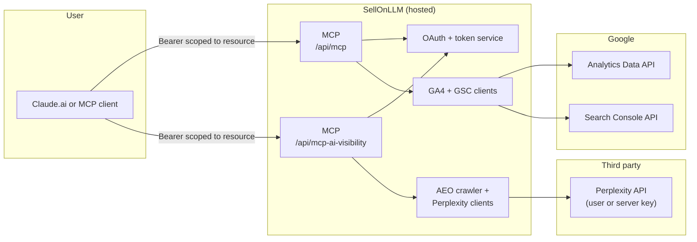

# SellOnLLM MCP for Claude — GA4, GSC & AI visibility

**Connect hosted [Model Context Protocol](https://modelcontextprotocol.io) (MCP) servers to Claude** — no self-hosted MCP runtime, no database to operate yourself. SellOnLLM runs the infrastructure; you add **one or two** custom connector URLs in Claude and complete Google OAuth.

| Product | Paste in Claude (Server URL) | Setup & UX |
|---------|------------------------------|------------|
| **Analytics** — GA4 + GSC | `https://www.sellonllm.com/api/mcp` | [GA + GSC MCP for Claude](https://www.sellonllm.com/google-analytics-mcp-claude.html) |
| **AI visibility** — AEO crawl + Perplexity citation tools | `https://www.sellonllm.com/api/mcp-ai-visibility` | [AI Visibility MCP for Claude](https://www.sellonllm.com/ai-visibility-mcp-claude.html) (includes **Perplexity API key** form) |
| **Web chat** (BYOK to your LLM) | *(not MCP — uses API key in browser)* | [Chat with GA + GSC](https://www.sellonllm.com/chat-with-google-analytics.html) |

This folder (`mcp-ga-gsc-seo/`) in the SellOnLLM monorepo documents the **Analytics** MCP (GA4 + GSC) and includes cross-links for the **AI visibility** MCP. **AI-visibility-only** docs (mirroring this layout) live in the sibling folder **`mcp-ai-visibility/`** and on GitHub: **[github.com/vipul510-web/mcp-ai-visibility](https://github.com/vipul510-web/mcp-ai-visibility)** (issues for both products currently use that repo). Operator implementation: parent repo `MCP_CLAUDE_SETUP.md` and `api/`.

---

## Table of contents

1. [Why this exists](#why-this-exists)
2. [Who it helps](#who-it-helps)
3. [What you get in practice](#what-you-get-in-practice)
4. [How MCP helps compared to exports and generic AI](#how-mcp-helps-compared-to-exports-and-generic-ai)
5. [Quick start (Claude.ai) — both connectors](#quick-start-claudeai--both-connectors)
6. [Built-in prompts in Claude (`/` menu)](#built-in-prompts-in-claude--menu)
7. [Tools reference](#tools-reference)
8. [Example workflows (copy ideas into your chats)](#example-workflows-copy-ideas-into-your-chats)
9. [AI visibility MCP (summary)](#ai-visibility-mcp-summary)
10. [AEO, GEO, and classic SEO](#aeo-geo-and-classic-seo)
11. [Security & privacy (summary)](#security--privacy-summary)
12. [What you do *not* need to run](#what-you-do-not-need-to-run)
13. [Troubleshooting & FAQ](#troubleshooting--faq)
14. [For agencies and teams](#for-agencies-and-teams)
15. [Architecture (high level)](#architecture-high-level)
16. [Repository layout](#repository-layout)
17. [Support & contributing](#support--contributing)
18. [License](#license)

**Deep dives:** [`docs/USE_CASES.md`](docs/USE_CASES.md) · [`docs/AI_VISIBILITY.md`](docs/AI_VISIBILITY.md) · [`docs/ADVANCED.md`](docs/ADVANCED.md)

---

## Why this exists

Most SEO and growth work still depends on **GA4** and **GSC** — impressions, queries, CTR, landing pages, sessions, and engagement. The painful part is getting those numbers **into** an AI assistant in a **trustworthy, repeatable** way: screenshots go stale, CSV exports are manual, and “please analyze my site” without data produces generic advice.

**Model Context Protocol (MCP)** lets an assistant call **structured tools** that return **your** metrics. This connector exposes GA4 and GSC as tools so the model can **ground** answers in your properties — weekly reviews, CTR rewrites, traffic-drop investigations, and content prioritization all become data-backed conversations instead of guesswork.

---

## Who it helps

| Role | How it helps |
|------|----------------|
| **In-house SEO / growth** | Faster weekly reviews, anomaly explanations, and prioritized backlogs without living in spreadsheets. |
| **Agencies** | Repeatable prompts and snapshots across clients (each user connects their own Google account). |
| **Founders & PMs** | Plain-language summaries tied to real traffic and search demand — not “SEO tips” disconnected from your site. |
| **Developers** | Inspect queries, landing pages, and device/geo splits when debugging releases, migrations, or Core Web Vitals follow-ups. |
| **Content teams** | Prioritize topics from **query + page + CTR + position** data, then draft outlines with evidence from GSC. |

---

## What you get in practice

After you [connect the MCP server](#quick-start-claudeai), you can ask Claude to:

- **Summarize** last week vs the week before (sessions, landing pages, top queries, CTR).
- **Find CTR opportunities** — high impressions, weak CTR, with suggested title and meta rewrites.
- **Find “almost page one” pages** (typical band: positions ~4–15) and get on-page and internal-linking ideas.
- **Explain traffic drops** — combine GA4 landing-page deltas with GSC impressions/clicks/position for the same URLs.
- **Run flexible reports** — dimensions and metrics you care about (within sensible row limits), instead of rebuilding reports in the GA UI every time.
- **List** all GA4 properties and verified GSC sites your Google account can access, then focus on one property + one site for the rest of the thread.

All of that is driven by **tool results** (numbers and tables) returned to the model, not by the model “remembering” your analytics from last month.

---

## How MCP helps compared to exports and generic AI

| Approach | Limitation | With this MCP |
|----------|------------|----------------|
| Pasting screenshots | Stale, incomplete, not reproducible | Claude pulls **current** aggregates via tools. |
| Manual CSV export | Slow, error-prone, hard to compare periods | Ask for comparisons and deltas in natural language. |
| Generic “improve my SEO” | No access to **your** queries, pages, or CTR | Answers reference **your** GSC + GA4 data. |
| Only GSC or only GA4 | Misses behavior vs demand | Combine **demand** (GSC) with **on-site behavior** (GA4). |

---

## Quick start (Claude.ai) — both connectors

### A) Analytics (GA4 + GSC)

1. Open [claude.ai](https://claude.ai) → **Settings** → **Connectors**.  
   *Team / Enterprise:* **Organization settings → Connectors** if your admin enabled custom connectors.*
2. Click **Add custom connector** (or **+** next to Connectors).
3. **Server URL:** `https://www.sellonllm.com/api/mcp`
4. Click **Connect** → complete **Google** sign-in → approve **read-only** Analytics + Search Console access → **Allow** on the SellOnLLM consent screen.
5. Return to chat. Example: *“List my GA4 properties and Search Console sites, then give me a 28-day SEO snapshot for my main property.”*

### B) AI visibility (AEO + optional Perplexity)

1. **Add custom connector** again (second URL; requires a Claude plan that allows **multiple** connectors — Free may allow only one).
2. **Server URL:** `https://www.sellonllm.com/api/mcp-ai-visibility`
3. **Connect** → same Google account flow → **Allow**.
4. Save your **Perplexity API key** on the [AI Visibility setup page](https://www.sellonllm.com/ai-visibility-mcp-claude.html) (same Google session) if you will use Perplexity-backed tools.
5. Example: *“Run analyze_website_aeo on https://example.com and summarize the top 5 AEO fixes.”* (no Perplexity key needed for that tool.)

**You do not paste OAuth metadata URLs** — Claude discovers them from the server. Power users: [`docs/ADVANCED.md`](docs/ADVANCED.md). Product pages: [Analytics MCP](https://www.sellonllm.com/google-analytics-mcp-claude.html) · [AI Visibility MCP](https://www.sellonllm.com/ai-visibility-mcp-claude.html).

### Optional: Claude Desktop with `mcp-remote`

Reach the **hosted** servers via a local bridge (no SellOnLLM code on your machine):

```json
{
  "mcpServers": {
    "sellonllm-analytics": {
      "command": "npx",
      "args": ["-y", "mcp-remote", "https://www.sellonllm.com/api/mcp"]
    },
    "sellonllm-ai-visibility": {
      "command": "npx",
      "args": ["-y", "mcp-remote", "https://www.sellonllm.com/api/mcp-ai-visibility"]
    }
  }
}
```

Place this in your Claude Desktop MCP config. You’ll still complete OAuth in the browser when first connecting each server.

---

## Built-in prompts in Claude (`/` menu)

**Analytics MCP** — when `/api/mcp` is connected:

| Prompt theme | What it’s for |
|--------------|----------------|
| **ctr_audit** | Titles/metas for low-CTR, high-impression queries |
| **content_gaps** | New content ideas from queries and landing pages |
| **rank_booster** | On-page improvements for pages ranking ~4–15 |
| **monthly_review** | Structured monthly SEO report |

**AI visibility MCP** — when `/api/mcp-ai-visibility` is connected:

| Prompt theme | What it’s for |
|--------------|----------------|
| **aeo_site_audit** | Crawl + AEO scorecard for a URL you provide |
| **ai_visibility_pulse** | Quick Perplexity citation checks for a few prompts |

Long-form **copy/paste prompts:** [`docs/PROMPTS.md`](docs/PROMPTS.md) · [GA + GSC MCP page](https://www.sellonllm.com/google-analytics-mcp-claude.html) · [AI Visibility MCP page](https://www.sellonllm.com/ai-visibility-mcp-claude.html).

---

## Tools reference

### Analytics MCP (`POST /api/mcp`)

| Tool | Purpose |
|------|---------|
| `list_ga4_properties` | List GA4 properties your Google account can access |
| `list_search_console_sites` | List verified GSC properties (sites) you can access |
| `get_seo_snapshot` | One-call **28-day** GA4 + GSC summary for a quick briefing |
| `query_ga4` | Flexible GA4 Data API report: dimensions, metrics, date range, filters |
| `query_search_console` | Flexible Search Analytics query: query/page/device/country/date, etc. |
| `find_ctr_opportunities` | High-impression, low-CTR queries — snippet optimization candidates |
| `find_ranking_opportunities` | URLs/queries in the **~4–15** position band — “push to page one” candidates |
| `get_traffic_deltas` | **Last N days vs previous N days** per page — ideal for “what broke?” investigations |

More narrative detail: [`docs/TOOLS.md`](docs/TOOLS.md).

### AI visibility MCP (`POST /api/mcp-ai-visibility`)

| Tool | Purpose |
|------|---------|
| `analyze_website_aeo` | Crawl public pages, AEO / citability scorecard (no Perplexity required) |
| `check_ai_visibility` | Perplexity citation check for one query vs one URL |
| `discover_ranking_prompts` | Generate prompts from site, test visibility (rate-limited) |
| `get_visibility_report` | Combined visibility report (custom + auto prompts; caps) |
| `compare_competitor_visibility` | You vs competitors on the same prompts (caps) |

Full detail, limits, and Perplexity setup: [`docs/AI_VISIBILITY.md`](docs/AI_VISIBILITY.md).

---

## Example workflows (copy ideas into your chats)

Use these as **templates** — tweak date ranges, segments, and property names.

1. **Monday stand-up (10 minutes)**  
   *“Give me sessions, top organic landing pages, and top GSC queries for the last 7 days vs the prior 7 days. Flag anything that moved more than 20%.”*

2. **After a title/meta template change**  
   *“Compare CTR and impressions by page for the 14 days before vs after [date]. Which URLs improved or hurt?”*

3. **Before a content calendar refresh**  
   *“From GSC: top 50 queries by impressions where we rank 6–12. Propose 10 new articles or major refreshes with working titles and which existing pages to link from.”*

4. **Technical release / migration sanity check**  
   *“Using GA4 and GSC, did any URL pattern under /blog/ or /products/ lose organic sessions or impressions week-over-week?”*

5. **International / device split**  
   *“Break down organic performance by country and device for the last 28 days. Where is CTR lagging desktop vs mobile?”*

6. **Stakeholder email (non-SEO audience)**  
   *“Write a 6-bullet executive summary of organic search health for last month, with 3 risks and 3 opportunities, all grounded in our data.”*

For full **ready-to-paste** prompt blocks, see [`docs/PROMPTS.md`](docs/PROMPTS.md). For **playbooks** (weekly check, CTR rescue, agency onboarding, **plus AI visibility flows**), see [`docs/USE_CASES.md`](docs/USE_CASES.md).

---

## AI visibility MCP (summary)

- **Different URL** from analytics — add both connectors in Claude if your plan allows.
- **Perplexity** — user saves their own API key on [ai-visibility-mcp-claude.html](https://www.sellonllm.com/ai-visibility-mcp-claude.html); optional server-wide `PERPLEXITY_API_KEY` for operators.
- **Use when** you care about answer-engine readiness (schema, FAQ, depth) and whether **AI search** surfaces cite your domain for specific prompts — not when you need GA4 session tables (use the analytics MCP for that).

---

## AEO, GEO, and classic SEO

- **Classic SEO** still wins when **crawlable, indexable** pages match **real search demand** — GSC queries, pages, CTR, and positions are the feedback loop.
- **AEO (answer-engine optimization)** and **GEO (generative-engine optimization)** add a layer: which **entities**, **facts**, and **citations** LLMs tend to reuse often correlate with **strong, trustworthy pages** that already earn clicks and engagement.
- The **analytics** MCP does **not** “submit you to ChatGPT.” It gives you **grounded** traffic and query data so you can prioritize **technical fixes**, **content depth**, and **measurement** where it actually moves numbers.
- The **AI visibility** MCP adds **crawl-based AEO signals** and **optional Perplexity citation checks** so you can prioritize how LLM-facing surfaces might treat your pages — complementary to GA/GSC, not a replacement.

---

## Security & privacy (summary)

- **Google OAuth** — you sign in with Google; we never see your Google password.
- **Read-only** Google API scopes for Analytics and Search Console — no permission to change your GA/GSC configuration from this product path.
- **Claude gets SellOnLLM-issued tokens** for MCP calls — **Google refresh tokens** stay on SellOnLLM servers and are stored **encrypted**.
- Treat model outputs as **draft analysis**; verify before major site or business decisions.

Full detail: [`docs/SECURITY.md`](docs/SECURITY.md).

---

## What you do *not* need to run

To use the **hosted** connector as an end user:

- No **Vercel** account  
- No **Neon / Postgres** (or any database you manage)  
- No **Google Cloud** project of your own  
- No clone of this repo required (unless you want to read docs offline or contribute)

SellOnLLM operates the infrastructure; you only connect OAuth in the browser.

---

## Troubleshooting & FAQ

**“Authorization failed” in Claude but tools still work**  
Some Claude UI versions show a false error. Try: *“List my GA4 properties.”* If tools return data, you’re connected. See [anthropics/claude-ai-mcp#132](https://github.com/anthropics/claude-ai-mcp/issues/132).

**Claude Free tier and custom connectors**  
Free tier may allow only **one** custom connector; paid tiers typically allow more.

**Google OAuth app in “Testing” mode**  
Only **test users** added in Google Cloud Console can complete OAuth until the app is published / verified for production.

**Multiple GA4 properties or GSC sites**  
Ask Claude to list them, then say explicitly which property and site to use for the rest of the conversation.

More: [`docs/TROUBLESHOOTING.md`](docs/TROUBLESHOOTING.md).

---

## For agencies and teams

- Each **end user** completes **their own** Google OAuth — you do not share one service account key across clients (better for security and audit).
- Use **repeatable prompts** from [`docs/PROMPTS.md`](docs/PROMPTS.md) so analysts deliver consistent weekly reports.
- **Least privilege:** only grant access to the Google identities that should see that client’s data.

---

## Architecture (high level)



Claude never holds your **Google** refresh token; it holds **SellOnLLM-issued MCP access tokens** scoped to **`/api/mcp`** or **`/api/mcp-ai-visibility`**. Google credentials stay on SellOnLLM for analytics tools; Perplexity calls use the user’s saved key or an optional server fallback.

---

## Repository layout

| Path | Contents |
|------|----------|
| [`README.md`](README.md) | This file — overview, setup, workflows |
| [`docs/PROMPTS.md`](docs/PROMPTS.md) | Long copy/paste prompt templates |
| [`docs/TOOLS.md`](docs/TOOLS.md) | Analytics MCP tool categories and behavior |
| [`docs/AI_VISIBILITY.md`](docs/AI_VISIBILITY.md) | **AI visibility MCP** — tools, Perplexity BYOK, use cases |
| [`docs/SECURITY.md`](docs/SECURITY.md) | Security and privacy notes |
| [`docs/TROUBLESHOOTING.md`](docs/TROUBLESHOOTING.md) | Common issues |
| [`docs/USE_CASES.md`](docs/USE_CASES.md) | Playbooks: GA/GSC **and** AI visibility |
| [`docs/ADVANCED.md`](docs/ADVANCED.md) | OAuth discovery, curl checks (both endpoints) |
| [`LICENSE`](LICENSE) | MIT |

---

## Support & contributing

- **Issues (Analytics MCP / GA+GSC):** [github.com/vipul510-web/mcp-ga-gsc-seo/issues](https://github.com/vipul510-web/mcp-ga-gsc-seo/issues)  
- **Issues (AI visibility MCP):** [github.com/vipul510-web/mcp-ai-visibility/issues](https://github.com/vipul510-web/mcp-ai-visibility/issues)  

Include connector URL, client (Claude Web / Desktop / Cursor), time (UTC), and what you expected.
- **Product:** [SellOnLLM](https://www.sellonllm.com) · [Contact](https://www.sellonllm.com/contact-us.html) · [Privacy](https://www.sellonllm.com/privacy-policy.html)

Improvements to **documentation** (clearer prompts, FAQs, diagrams) are welcome via PR.

---

## License

Documentation in this repository is licensed under the **MIT License** — see [`LICENSE`](LICENSE). The **hosted MCP service** is operated by SellOnLLM; usage is subject to SellOnLLM’s terms and privacy policy on the website.

---

### GitHub Topics (for discoverability)

Suggested repository topics:  
`mcp` `model-context-protocol` `claude` `claude-ai` `ga4` `google-analytics` `google-search-console` `search-console` `seo` `aeo` `geo` `oauth2` `analytics` `llm` `ai` `ai-visibility` `perplexity` `answer-engine-optimization`
